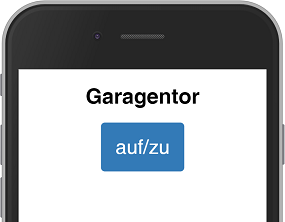
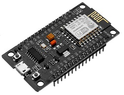
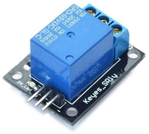
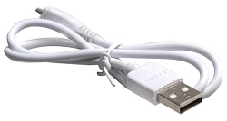
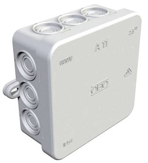
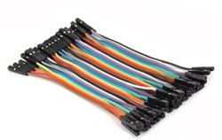
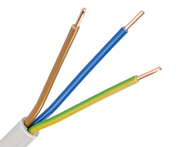
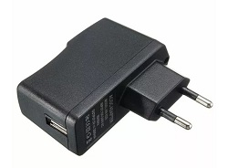
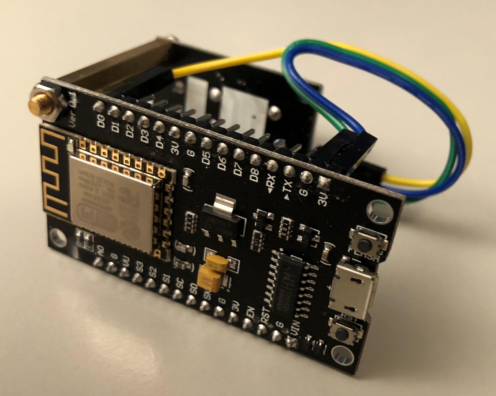
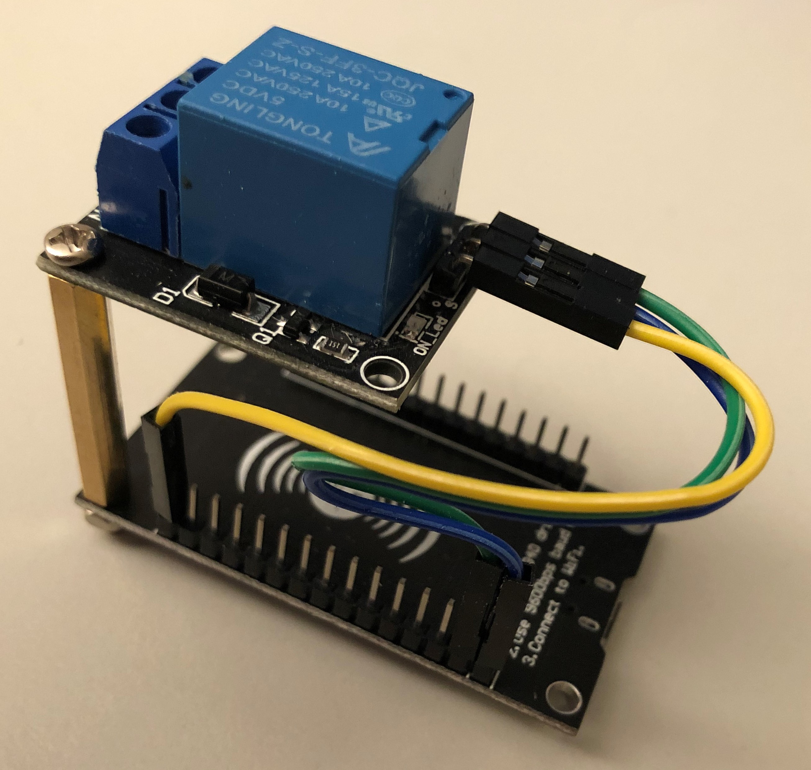

# garagedoor
> Control you garage door with your mobile phone

To remote control your garage door's push button via a relay to a nodeMCU.
The nodeMCU connects to our home WiFi and runs a web server. You can reach this web server from your mobile inside your home WiFi.



## 1. preparation
### hardware requirements

You require the following items (less than 11 EUR in total):

item | image | price
--- | --- | ---
1x nodeMCU |  | 3,60 EUR
1x Relay |  | 0,80 EUR
1x USB Cable |  | 1,50 EUR
1x Case |  | 1,80 EUR
3x 5v Cable |  <br> only 3 are required ;-) | ca. 0,10 EUR
2x 1.5mm² Cable <br>(depends on your garage door) |  | ca. 0.10 EUR
1x USB Power Adapter 240V/5V |  | 3,00 EUR

optional:
*   mount, screw and screw nut (M3)
*   you may need an additional power outlet as well

### prepare code
Before you compile the code you have to add a `passwd.h` file to the folder and add two lines.

`garage.ino` includes this file (see line 18: `#include "passwd.h"`).
`passwd.h` itself is not included in this GIT repo (see `.gitignore`) as I do not want to expose the credentials of my Wifi at home ;-)

Add the following two lines to `passwd.h` and replace the "..." with your Wifi SSID and password.

```c
const char* ssid = "...";
const char* password = "...";
```

## 2. mount the hardware

### development phase

1.  Connect the `3V` and `GND` from the nodeMCU with the `-` and `+` of the relay.
1.  Connect the `D0` of the nodeMCU to the `S` (signal) of the relay.
1.  During development you will use the USB cable to connect the nodeMCU to your computer.




### operations mode
Unplug the nodeMCU from your computer. Carry it to your garage and find a place with access to 230V and the push button that opens your garage (at least it's cable).

1.  Use an AC/DC power adapter and a USB cable to empower the nodeMCU.
1.  connect the relay to your garage door's push button. Use the `NO` (normally open) and the `COM` ports of the relay. If you hit the "open" button with your mobile device the app will close the port for a few milliseconds and opens it again (same behaviour as you pushing the push button).

I'd recommend to connect the relay in parallel to the push button. So you can use both to open/close the door for your garage.

## 3. use it
> Open the following link in a web browser of a device in the same WiFi than the nodeMCU
> <http://garage/>

### Advances usage
Use http://garage/?ops=oc for directly sending an open/close command

Use http://garage/?log=list for enabling a command log output on the webpage

You may combine both params of course, e.g. http://garage/?ops=oc&log=list


### customisations

#### circuit time
Depending on your garage door you may have to adapt the circuit time, see line 61 of `gargage.ino`

```c
if (server.arg("ops").length()>0 && String(server.arg("ops")) == "oc") {
  ...
  digitalWrite(relayPin, HIGH);
  delay(500); //you may have to change this delay
  digitalWrite(relayPin, LOW);
  ...
}
```


#### hostname
If you do not like this hostname check line 23 of `gargage.ino` and change it.
```c
const char* WiFi_hostname = "garage";
```

# credits & thanks
Thanks to Sarah Ali, her code and blog helped a lot to speed up this project (see <http://onlineshouter.com/how-to-control-a-relay-from-a-web-page-with-nodemcu/>)

Thanks to the one who made the "remote" image available for re-use on Wikimedia Commons (see <https://commons.wikimedia.org/wiki/File:Ic_settings_remote_48px.svg>).
